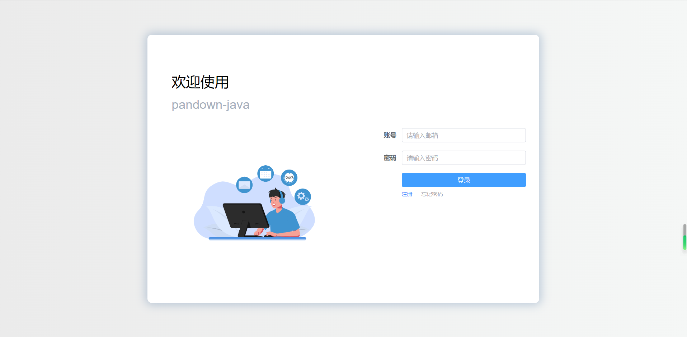
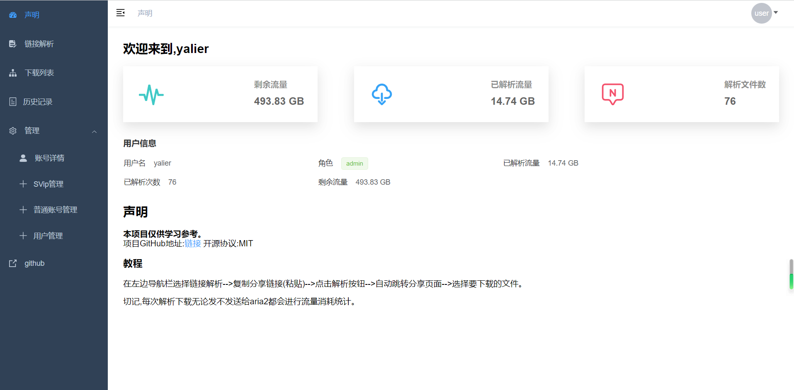
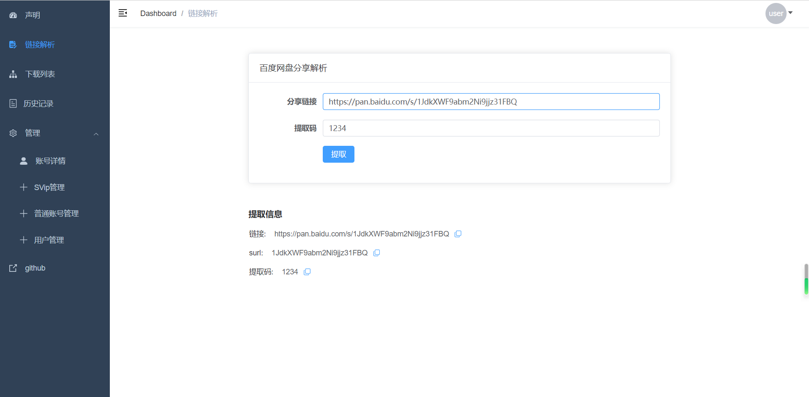
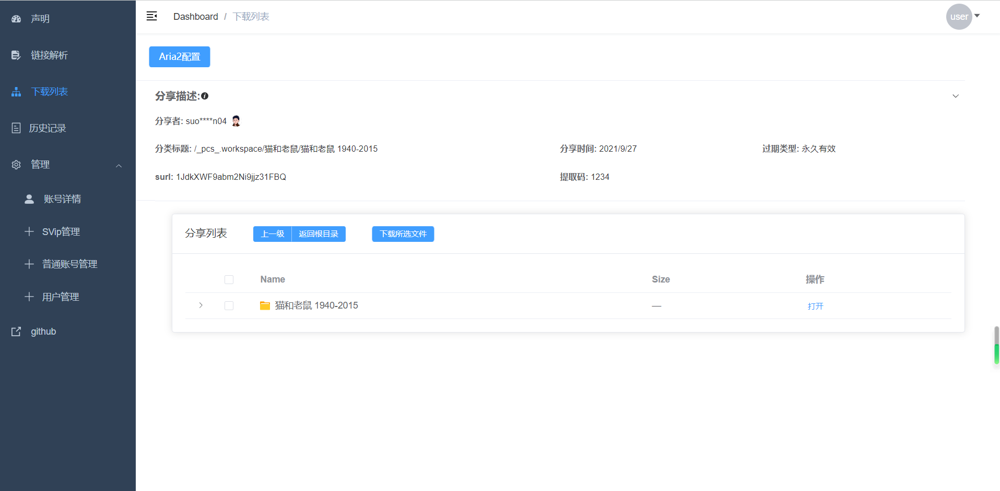
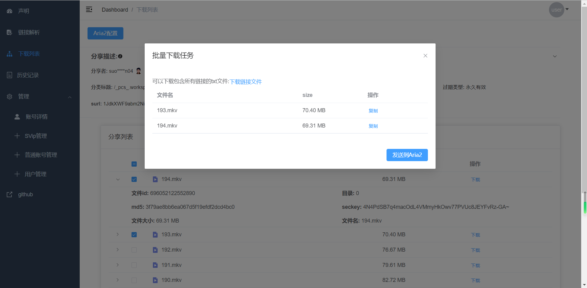
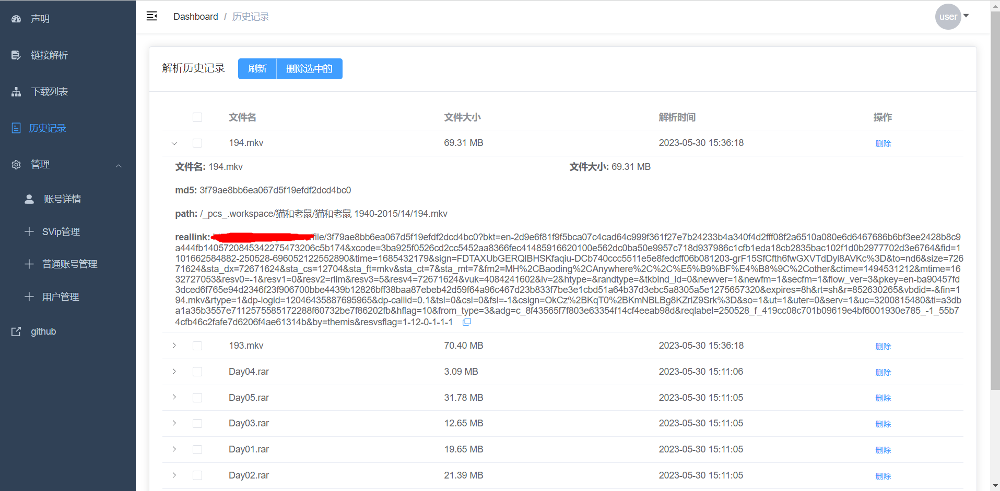
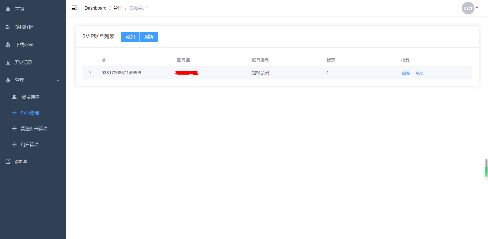
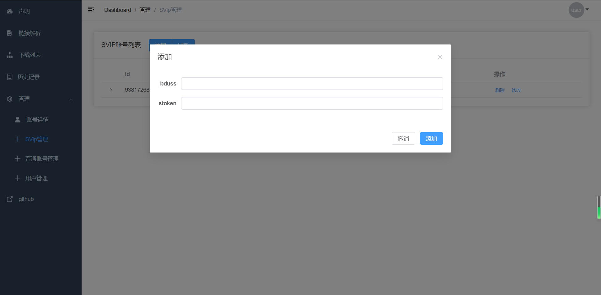
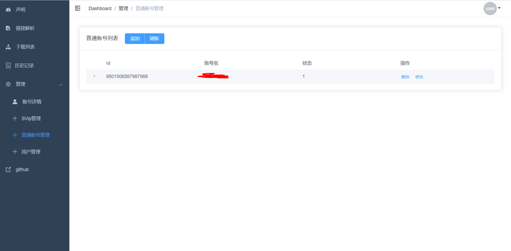
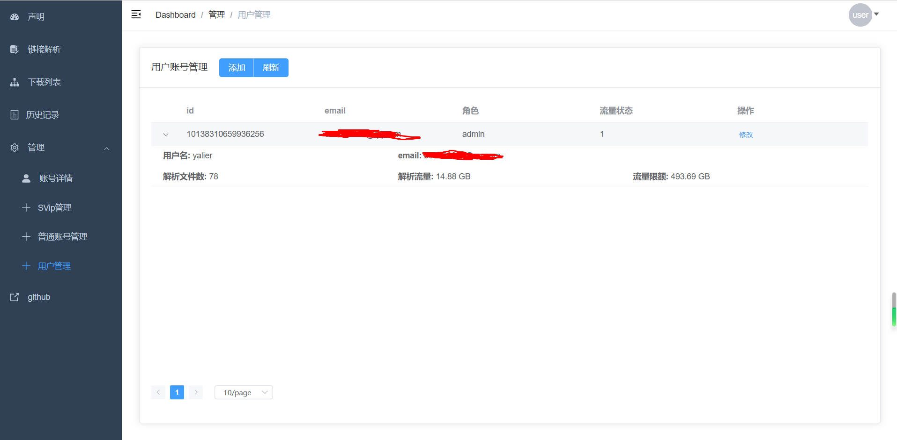

# download-ui

## introduce

项目前端使用`Vue3+element-plus+Ts`构建

### show

#### login page




#### home page




#### parse page




#### download page






#### download history page




#### Svip account manage page






#### common account manage page




#### user manage page




## Using Tutorials

#### user

Copy the Baidu sharing link to the parsing page.

After parsing, select the file to be parsed on the download list page

After parsing, you can choose to send the parsing results to Aria2, or download the link file and go to Xunlei to create a new download task.

#### admin

Adding an SVIP account requires BDUSS and stoken.

Adding an common account requires all cookies of account.

Administrators can control user network traffic.


#### register

Registration can only be registered as a regular user.

Administrator users require other administrators to set them up, or modify ordinary users to administrators in the database. (Need to modify the role permissions of the account)

## Project Setup

```sh
npm install
```

### Compile and Hot-Reload for Development

```sh
npm run dev
```

### Type-Check, Compile and Minify for Production

```sh
npm run build
```

### Run Unit Tests with [Vitest](https://vitest.dev/)

```sh
npm run test:unit
```
